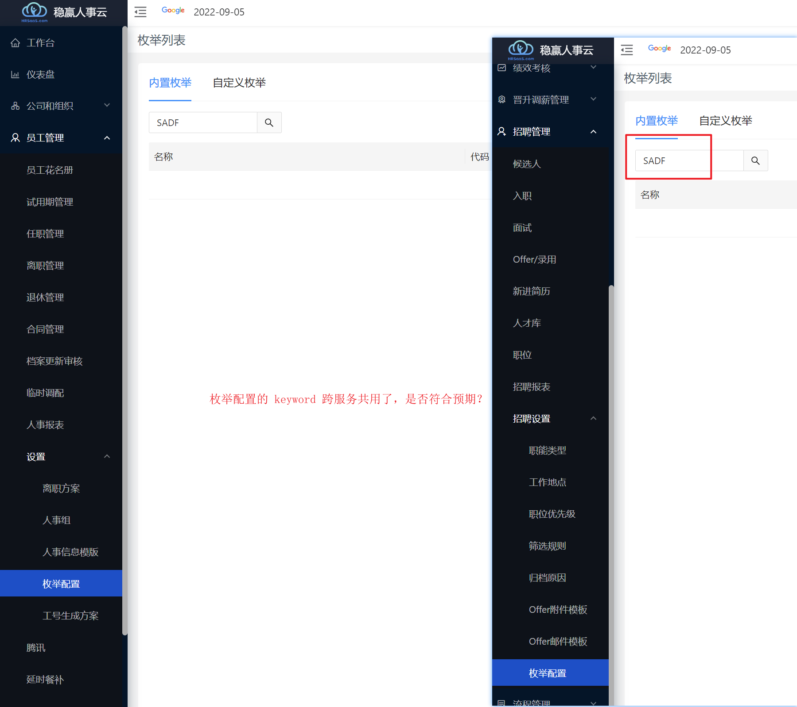

### Moka集成

### 提供给外部的接口及可能需要的改造

### 系统内的功能支持
1. 候选人信息-招聘信息
2. 创建 Offer-招聘信息
3. （入职）待入职、已入职、取消入职的招聘信息
4. 正式员工的招聘信息

#### Question：
- enumName是否都需要后端提供？之前应该是前端自定义了 meta 对应

#### 估计：
- config enum都需要放到 common 中，因为 payroll 和 recruitment 都用到了

### 前端改动支持

- 渠道为内推时，招聘来源默认为内推，同时出现选择内推人的输入框

### 数据升级

### 问题
1. BO 上的 xxxSelector 有什么作用？
- listBoMeta 时会尝试获取 validValueList,前端可用于校验
2. 定义在招聘，payroll 怎么用？
- 使用BusinessField 中的 ceGlobal；
[跨微服务使用ConfigurableEnum](https://doc.weixin.qq.com/doc/w3_AEYAYwYyAEU13WOGXbORY685yUEk1?scode=ALwAoAeTAAcrVz0z4O)
3. dozermapping中的次mapping可能需要考虑是否删除

<mapping>
      <class-a>com.wyc.hr.recruitment.recruit.RecruitInfo</class-a>
      <class-b>com.wyc.hr.recruitment.client.dto.candidate.RecruitInfoDTO</class-b>
      <field type="one-way">
      <a>candidate.id</a>
      <b>candidateId</b>
      </field>
	</mapping>

可能需要考虑删除，因为现在 map 等操作都是用新的 dto 来做的，不过新的 dto 可能也需要，主要是不知道这里不加会影响到什么
4. int 模块中用到了招聘信息，考虑是否需要做对应修改，因为招聘信息其实是没同步的
5. 编写testCase；创建一个人才，如果存在则用其创建一个候选人，如果候选人存在，则为该候选人创建一个招聘信息，
如果招聘信息存在则更新；
6. 
7.

    @Column(name = "CERTIFICATE_TYPE", length = 32)
    @BusinessField(label = "证件类型", ceType = @GlobalCEType(namespace=NamespaceRegistry.MASTER_DATA, type="CertificateType", parentType=""))
    private ConfigurableEnum certificateType;

http://app.wyc.com/api/recruitment/resumes/createResumeTalentCandidate

